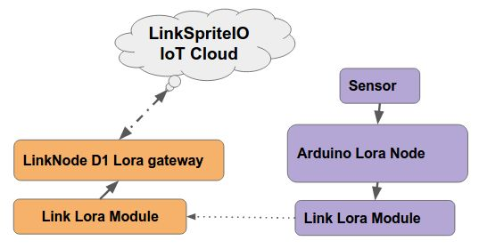
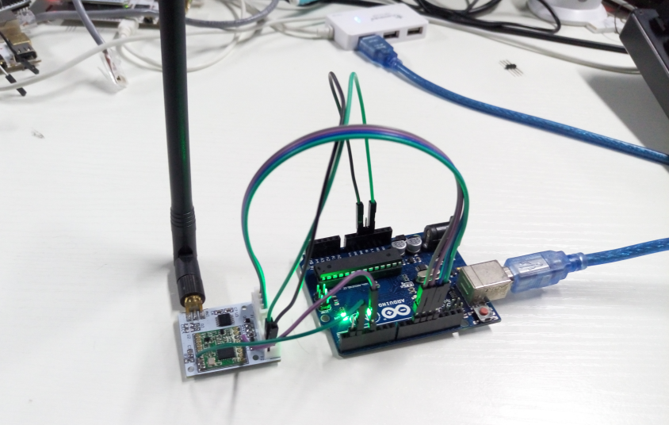
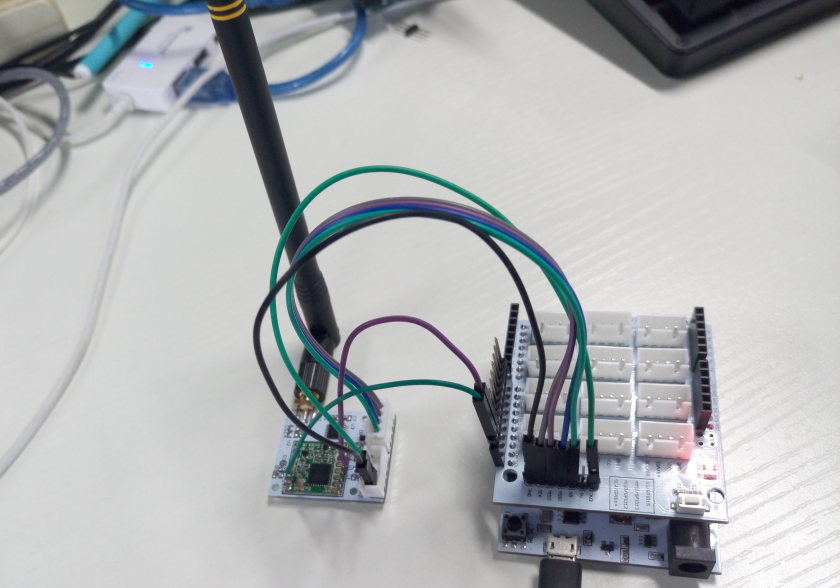
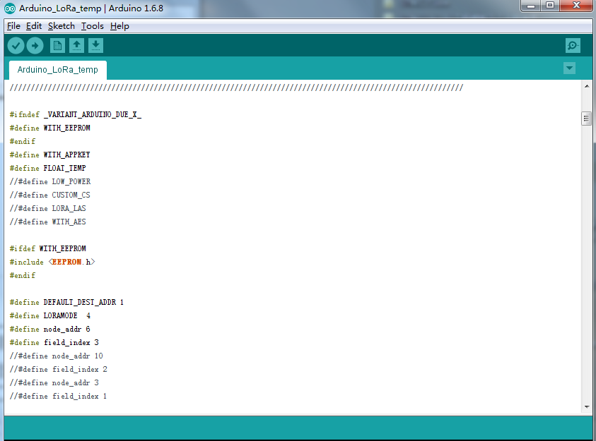
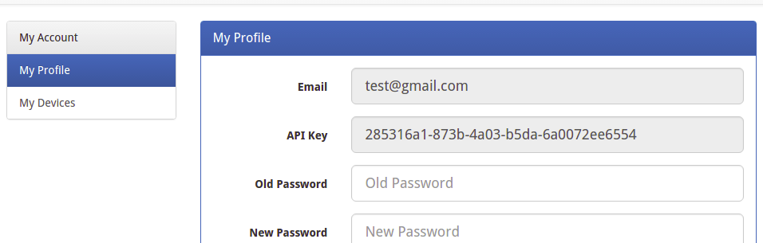
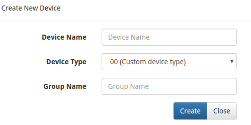
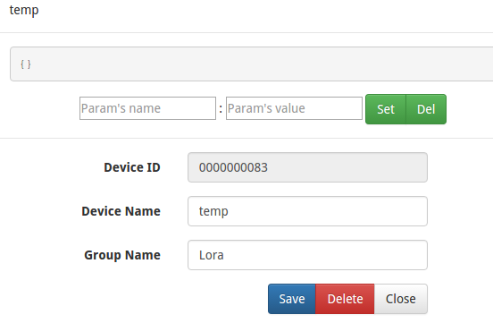
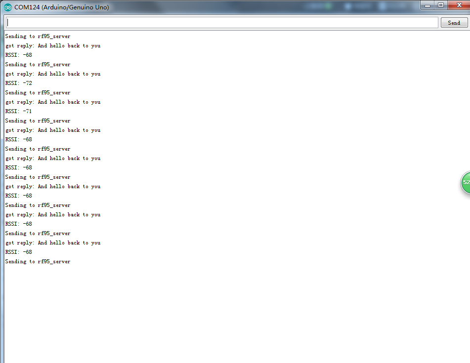
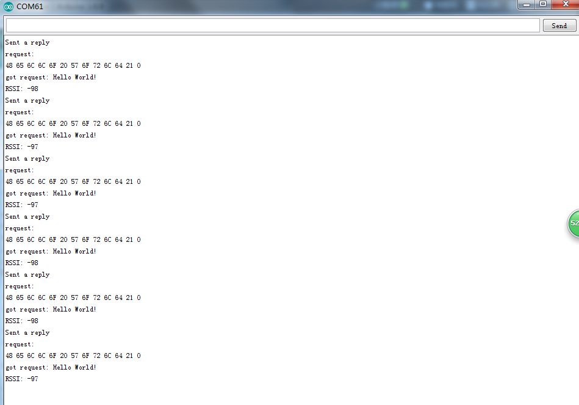
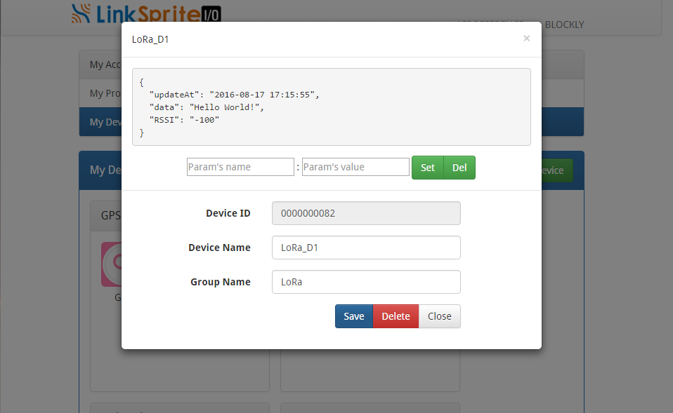

# A DIY low-cost LoRa gateway based on LinkNode D1
Thanks to this [open source project](http://www.airspayce.com/mikem/arduino/RadioHead/) which privade RadioHead library use RF chips. We port this project to LinkNode D1 and send the received data from Lora node to [LinkSpriteIO](www.linksprite.io). The basic architecture is shown as the following diagram.



There is an Arduino Lora node to read the sensor's data and send it to pcDuino Lora gateway. After LinkNode D1 Lora gateway recevice the data and it will send it to LinkSpriteIO which is our IoT cloud.

The following content, I will introduce the details of how to DIY a low-cost Lora gateway with LinkNode D1 and Arduino.

## Required
**LinkNode D1 lora gateway**
- LinkNode D1 x 1
- [LoRa module](http://www.linksprite.com/wiki/index.php5?title=Low-cost_LoRa_Module) x 1
- Linker Base for D1 x 1
- Dupont Line x 8

**Arduino lora node**
- Arduino Uno x 1
- [LoRa module](http://www.linksprite.com/wiki/index.php5?title=Low-cost_LoRa_Module)x 1
- Linker cable x 4
- Dupont Line x 4

## Steps

### 1. Assemble the hardware
* According to the following pins map table to connect the lora module and pcDuino or Arduino

| Lora module pins | Arduino Pins | LinkNode D1 Pins|
|:--------:|:--------:|:--------:|
|SCK|D13|GPIO14|
|MISO|D12|GPIO12|
|MOSI|D11|GPIO13|
|NSS|D10|GPIO15|
|RST|D4|GPIO4|
|DIO0|D2|GPIO5|
|VCC|3.3V|3.3V|
|GND|GND|GND|
#### Arduino Lora node



#### LinkNode D1 Lora Gateway



### 2. Program Arduino Uno
- Download the program from [github](https://github.com/delongqilinksprite/linknoded1-lora-ap.git)
- Use Arduino IDE to open the **rf95_client** project in examples folder
- Upload this program to Arduino Uno
- Open Serial Monitor to check the message



### 3. Program on the LinkNode D1
#### Create device on LinkSpriteIO 
* Go to **www.linksprite.io** and sign up
* Enter your Email and password to create a new account
* Go to **My Account** to get your own **API Key**. 

 
* Click **My Device**, and choose **Create DIY Device**.
 

 
* Click the created device icon and get the **DeviceID** **.
 


* Use your own deviceID and apikey to update the line 23 and 24 in rf95_server
```python
 26 # Use your own deviceID and apikey
 27 deviceID="xxxxxxxxxx"
 28 apikey = "xxxxxxxxxxxxxxxxxxxxxxxxxxxxxxxxxxxx"
```

- Download the LinkSpriteIO library [github](https://github.com/delongqilinksprite/LinkSpriteIO.git)
- Use Arduino IDE to open the **rf95_server** project in examples folder
- Import the LinkSpriteIO library
- Upload this program to LinkNode D1
- Open Serial Monitor to check the message

### 4. Test
To make it simple, we just use Arduino LoRa client send "hello word" to LinkNode D1 LoRa server.and then server reply.

On Arduino side:


On LinkNode D1 side:


On LinkSpriteIO side:



